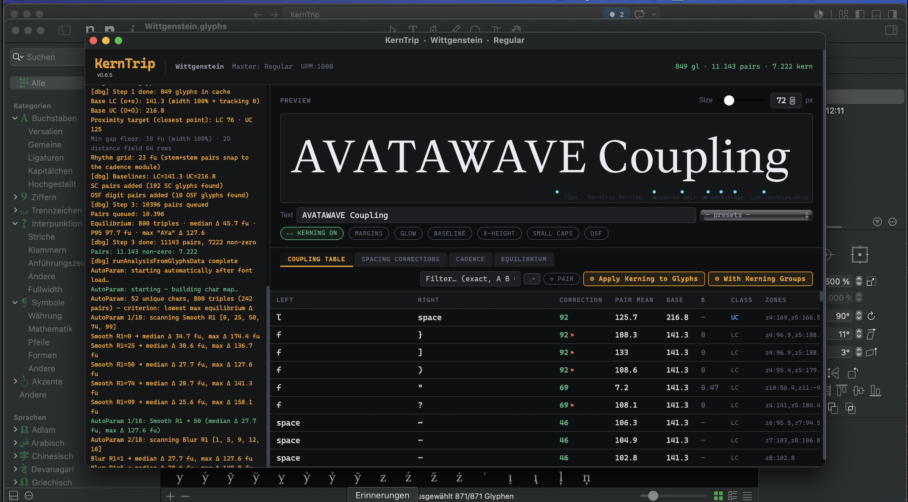
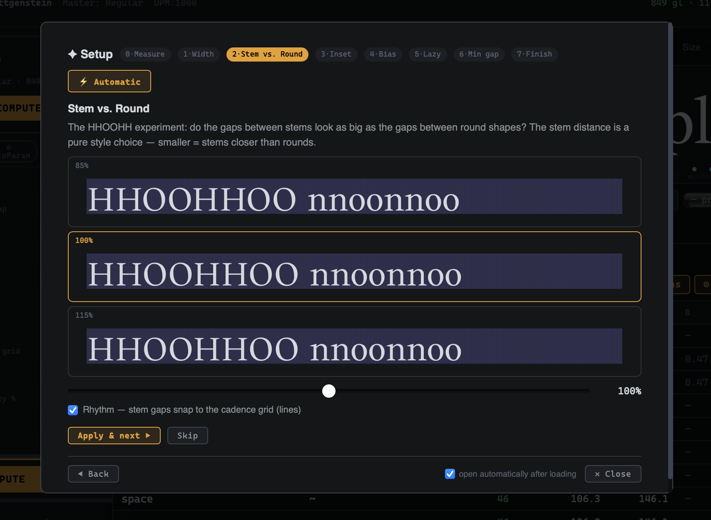
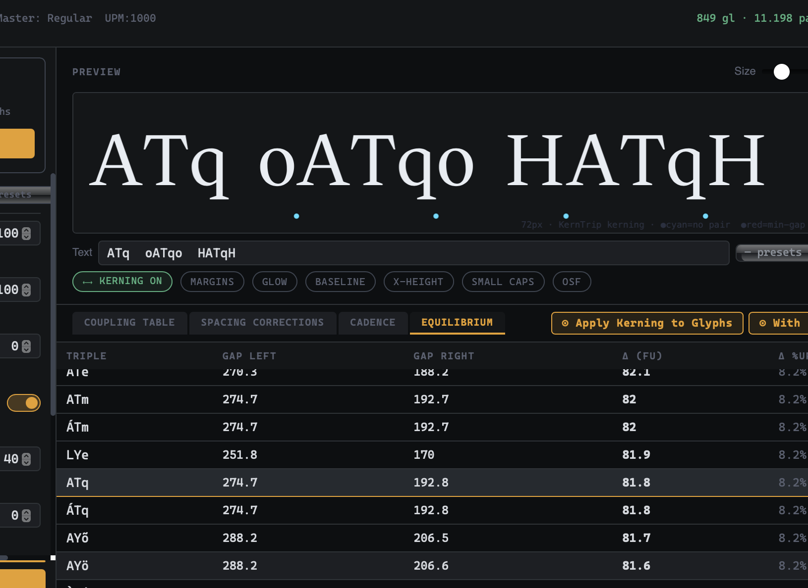
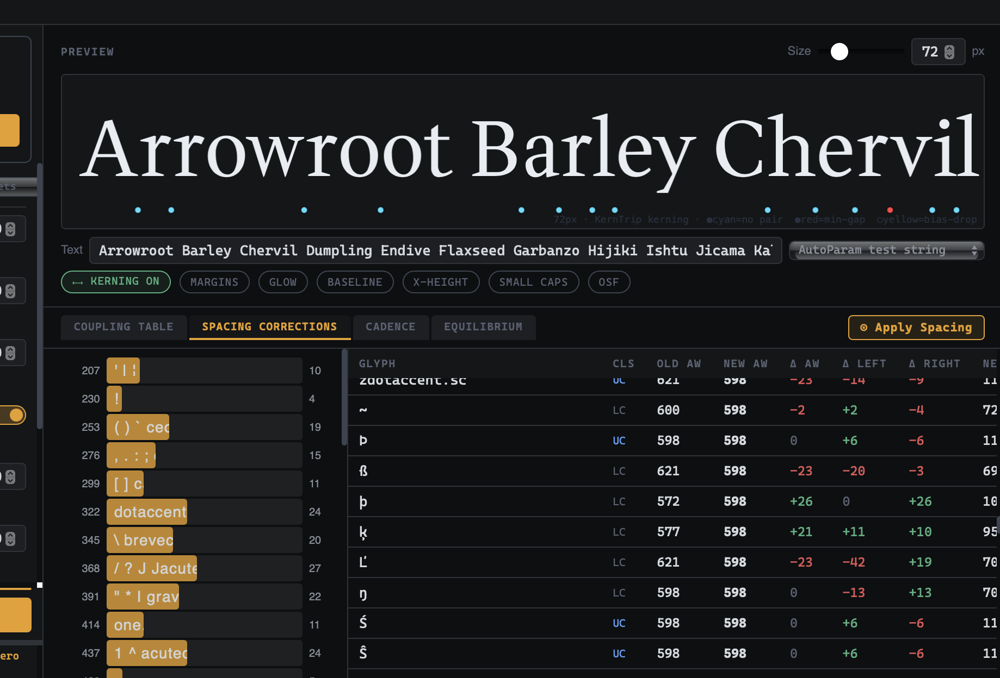
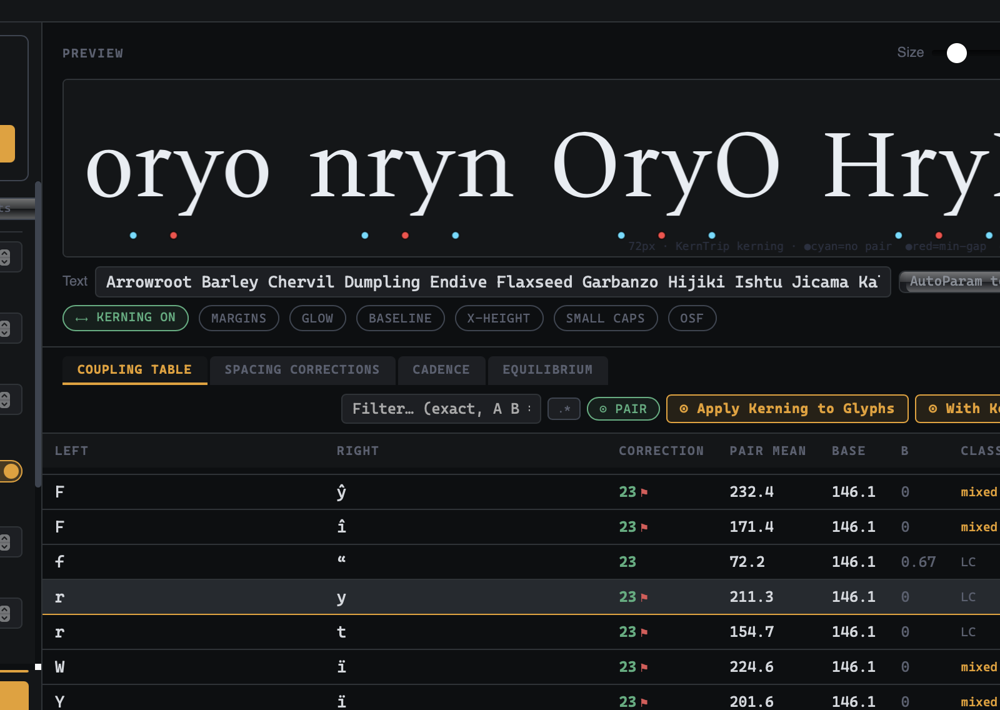
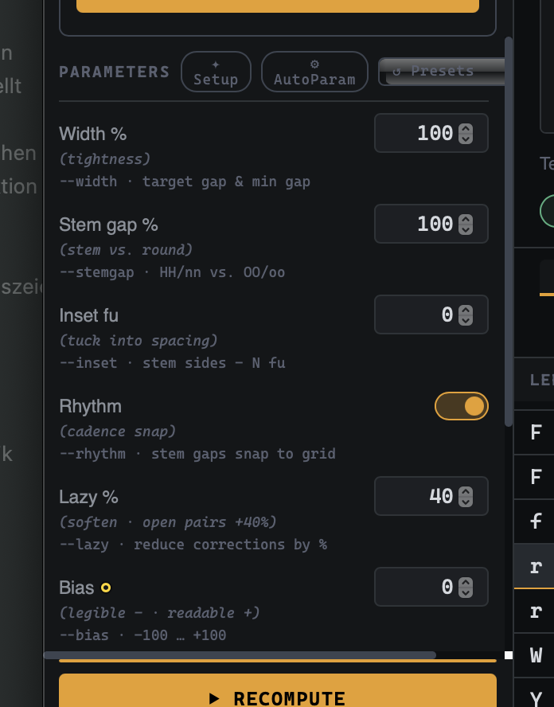

# KernTrip in Glyphs — How-To

KernTrip computes optical **spacing** (sidebearings, advance widths) and
**kerning** from the glyph outlines of the open font. This guide walks
through the intended workflow in Glyphs and explains what each parameter
actually does to the result.

> Works the same in the browser version (`index.html`, drag & drop a
> TTF/OTF) — only *Apply* is Glyphs-only; the browser exports CSV instead.

---

## 1. The workflow at a glance

```
Load font → AutoParam (automatic) → Setup assistant (6 design choices)
          → full computation → Equilibrium check
          → Spacing tab  → Apply Spacing
          → recompute    → Kerning table → Apply (or Group kerning)
```

The order matters once: **apply spacing first, then compute kerning.**
Spacing sets the class-wide white (what o, n, H share); kerning carries
only what sidebearings cannot express. If you kern before applying
spacing, the kerning absorbs work that belongs in the sidebearings.

### Step by step

1. **Open the font in Glyphs**, then *Script menu → KernTrip*. The **Load & Compute** buttion   requests the outlines, measures every glyph, and runs *AutoParam*
   (which scans smooth/blur/min-gap until the triple equilibrium is stable,
   and documents the result in *Font Info → Notes*).

   <!-- screenshot: KernTrip window right after loading a font — status log
        with "Margins: N glyphs" and the AutoParam note -->
   

2. **Setup assistant** opens automatically (can be disabled via its
   checkbox). It walks through the six *design* values — everything else
   is measured. Each step shows three clickable variants (optician
   principle: "better like this — or like this?") plus a fine slider,
   rendered live with your actual outlines.

   <!-- screenshot: wizard step 2 "Stem vs. Round" with the three
        HHOOHHOO variants and the cadence grid lines -->
   

3. **Finish** runs the full computation over the corpus pairs and jumps
   to the **Equilibrium** tab: triples like `non`, `HOH` are checked for
   left/right white balance; the worst ones are listed as bench tests —
   click one to see it in the preview.

   <!-- screenshot: Equilibrium tab with the worst-triples list -->
   

4. **Spacing tab** shows one row per glyph: old/new advance width, the
   left/right corrections, and the resulting sidebearings (whole font
   units; a rounding rest always goes to the right side). The histogram
   groups glyphs by resulting width. **Apply Spacing** writes it to the
   font.

   <!-- screenshot: Spacing Corrections table incl. histogram -->
   

5. **Recompute** (▶) on the freshly spaced font, then review the
   **kerning table**: β column shows the contact character of each pair,
   ♩ marks rhythm-snapped pairs, ⚑ pairs held apart by the min gap.
   **Apply** writes flat pairs; **Group kerning** compresses them into
   kerning classes first.

   <!-- screenshot: kerning table with a ♩ and a ⚑ pair visible -->
   

---

## 2. The two models — why spacing and kerning are separate

Every pair is judged by a blend of two readings:

- **Air model** — the average white between two glyphs should match the
  reference (o+o for lowercase, O+O for caps). This is what *spacing*
  can express: per-glyph sidebearings.
- **Contact model** — at the closest point, ink should approach as
  closely as it does in the reference pair. Bulges tuck into stems.
  This is inherently *pairwise*: o·o is right, n·n is right, and o·n
  still wants to be tighter — no sidebearing assignment can do all
  three. That residue is kerning.

The blend factor **β** (0 = pure air, 1 = pure contact) is derived from
the gap profile of each pair and shown as a table column.

**Example** (demo font, `demo/demo-Regular.ttf`): after spacing, o and n
have identical average margins, yet the kerning table shows `o;n −22` —
o's bulge sits 36 units farther from n's stem than in o+o, the contact
model claims about half of it (β 0.94, Lazy 50%), rounded to the module.
That pair is *correct*, not a bug — unless you decide to bake it into
the sidebearings with **Inset** (below).

---

## 3. The design parameters (front panel)

These are the six decisions the setup assistant asks for, plus the two
output controls. Everything under *Extended* is measurement tuning and
rarely needs touching.

| Parameter | Unit | What it does |
|---|---|---|
| **Width** | % | Scales the target gaps AND the min gap together — overall tightness (display vs. text). Tracking (Extended) is additive instead and does not change overlap limits. |
| **Stem gap** | % | The HHOOHH experiment: target distance of stem pairs relative to the round reference. Full effect on stem+stem, half on stem+round. A pure style choice. |
| **Inset** | fu | *Stem vs. round, part two:* moves the round-vs-stem tuck out of the kerning and into the sidebearings. Stem sides get the spacing target minus this value; after Apply Spacing the systematic `o·n`-type kerns collapse to 0 and stem gaps close by 2× the value. 0 = keep the tuck as kern pairs. The assistant measures this font's full tuck and offers 0 · ½ · full. |
| **Rhythm** | on/off | Stem+stem pairs snap their stem-to-stem distance to the cadence grid — the position snaps, not the value. Snapped pairs show ♩; snaps smaller than one module are dropped as noise. |
| **Lazy** | % | Softens all corrections (gentler kerning); deeply open pairs (r· L· T·) are softened up to 40 % more. |
| **Bias** | −100…+100 | Legible (−): stronger contact model, larger min gap, tightenings dropped more freely. Readable (+): stronger air model, even rhythm. One slider instead of a threshold. |
| **Min gap** | % of UPM | Hard floor for ink distance, checked as a true 2D distance field on the raw outline (catches diagonal near-misses). Capped pairs show ⚑ and are never dropped. |
| **Round module** | fu | All output values snap to this module (pre-filled from the cadence scan). Sub-module values never reach the output. |
| **Pair limit** | count | Top-N pairs by real-text frequency (Fuchs corpus); 0 = all. |

<!-- screenshot: parameter panel, front section, with Inset visible -->


---

## 4. Worked example: killing the round-vs-stem flood with Inset

With the demo font and **Inset 0**, the kerning list contains a uniform
block — every round-vs-stem pair needs one module:

```
o;n;-22   o;H;-22   o;I;-22   o;N;-22
n;o;-22   H;o;-22   I;o;-22   N;o;-22
O;n;-22   O;H;-22   O;I;-22   …
```

Open the setup assistant, step **Inset**, and pick the third variant
(*full tuck*, measured on this font: 39 fu). Then **Apply Spacing** and
recompute:

- the Spacing table now pulls every stem side in
  (e.g. `n  ΔL −22 ΔR −22`, `H  ΔL −11 ΔR −11`),
- the round-vs-stem block is gone from the kerning list,
- o and O themselves never move — they are the anchor, so repeated
  apply → recompute stays stable.

The half variant is the cautious middle: pairs at the average tuck
disappear, deeper ones (like o·I here) keep a single module.

<!-- screenshot pair: kerning list before (with the −22 block) and after
     Apply Spacing with Inset = full -->


---

## 5. Good to know

- **Idempotent by design:** running Apply Spacing or Apply twice changes
  nothing — targets are anchored on the base glyphs (o/O), which never
  move. As long as you don't change them...
- **Base glyphs** (Extended): the spacing/kerning reference, default
  `o`/`O`. The base is centered inside a module-snapped width; its rest
  unit always lands on the right sidebearing.
- **Narrow glyphs** (period, comma, j …) are re-centered within their
  computed width; `space`/`nbspace` take the width of `i`.
- **Runs are documented:** every apply writes its parameter line into
  *Font Info* (custom parameter + note), so you can always reconstruct
  which settings produced the metrics.
- **Logs** use the `[KernTrip]` prefix; errors appear in Glyphs' Macro
  panel.
