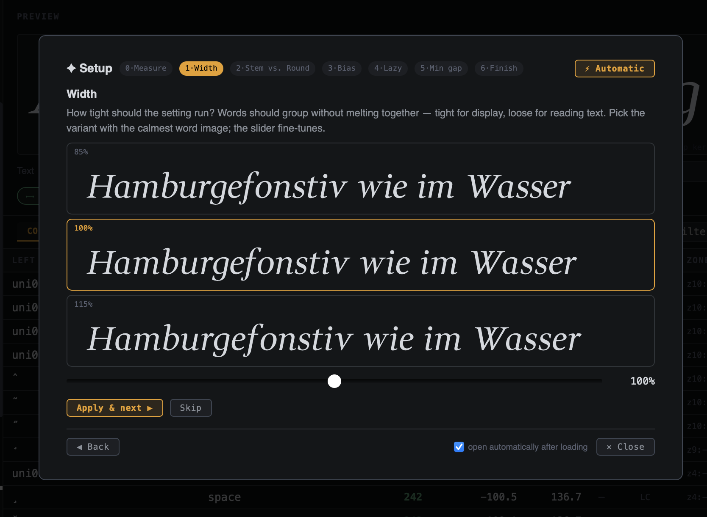
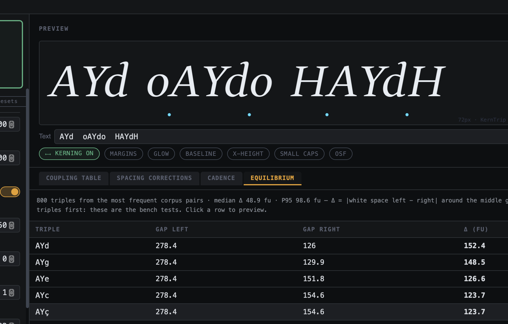
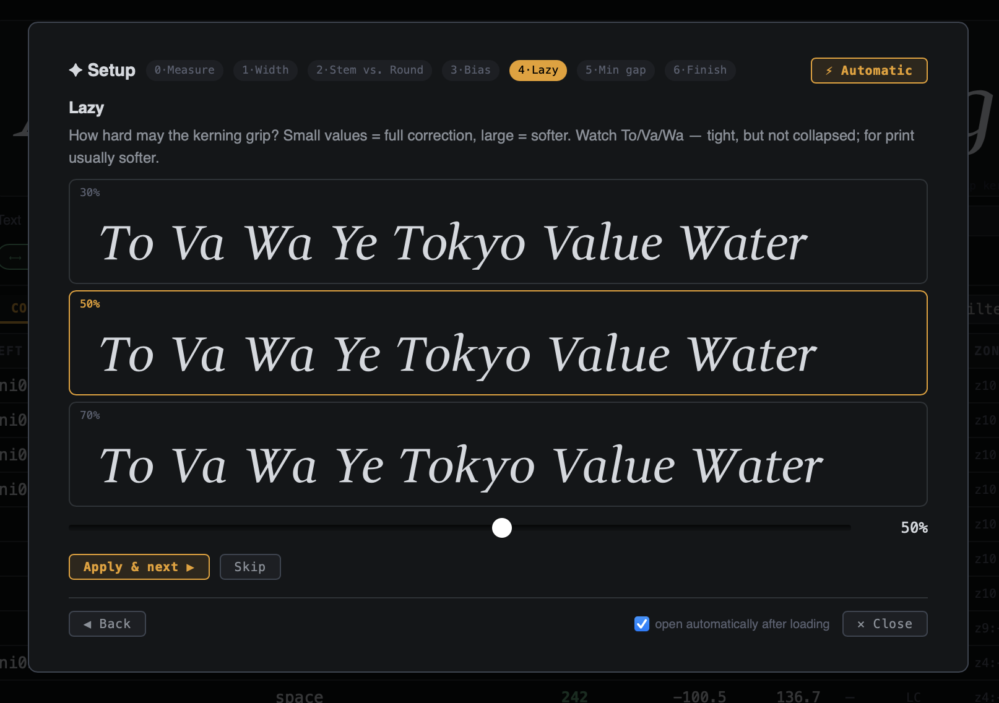

[](https://jrgdrs.github.io/KernTrip/)

# KernTrip

KernTrip computes optical spacing and kerning from glyph outlines.
No manual pair editing — all values come from the shapes themselves.

Two products, one code base:

- **Browser tool:** open `index.html`, drop a TTF/OTF font.
- **Glyphs 3 plugin:** `glyphs/KernTrip.glyphsPlugin` (installed from download);
  Script menu -> *KernTrip*.


## Test in your Browser

[](https://jrgdrs.github.io/KernTrip/)

You may test it live in your Browser now and without any further installations.

https://jrgdrs.github.io/KernTrip/

## Install in Glyphs

Download from https://jrgdrs.github.io/KernTrip/KernTrip.zip , unzip and doubleclick onto the Plugin to install it into Glyphs 3 (not version 2 but version 4 preview works also ;-). You find the call KernTrip in the Scrpts menu.

## Build by yourself

If you want to build it by yourself, try

```bash
bash make.sh    # assembles src/ -> ui.html, index.html, KernTrip.zip,
                # and installs the plugin into Glyphs 3
```

[](https://jrgdrs.github.io/KernTrip/)

## How it works, in short

- Glyph margins are measured in horizontal zones (plus a 64-row fine profile).
- Every pair is classified by its gap profile: convex pairs are set by their
  **closest point** (contact model), open pairs by their **mean gap**
  (air model); a blend factor *beta* mixes the two.
- Stem pairs snap to the **cadence grid** (rhythm) and get their own
  **stem gap** style control.
- A 2D distance field guards against collisions, a **bias** slider trades
  legibility against readability, and the **Equilibrium** tab scores how
  centered every glyph sits between its neighbors.
- The **Setup assistant** guides through the five design values on live type
  samples; the final step computes all corpus pairs.

Development notes for Claude Code live in `CLAUDE.md`.

## What It's Based On

This concept builds on my teacher Frank Blokland’s work on patterning in Movable Latin Type, as well as Igino Marini’s presentation on iKern at Atypi. It also draws on Andre Fuchs’s collection of the most common kerning pairs.
